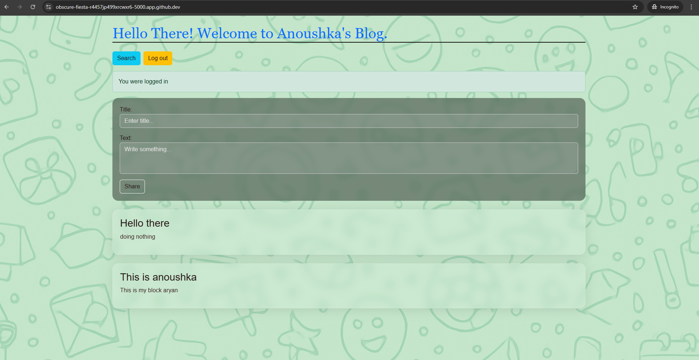

# 📝 Anoushka's Personal Blog

**Anoushka's Personal Blog** is a clean and minimal Flask-powered blogging platform with user login/logout, post creation, search, and a beautiful Bootstrap-based interface. It’s perfect as a personal blog or as a learning project for Flask beginners.

---

## 🌟 Features

- 🔐 User login & logout
- ✍️ Add new blog entries (title & content)
- 🔎 Search functionality
- 💬 Flash messages for user feedback
- 🎨 Responsive UI with Bootstrap 5 and custom styling
- 💾 SQLite database integration

---

## 📁 Project Structure

```
flaskr-tdd/
├── project/
│   ├── __init__.py
│   ├── app.py
│   ├── models.py
│   ├── templates/
│   │   └── (HTML files)
│   ├── static/
│   │   ├── style.css
│   │   └── main.js
│   └── flaskr.db
├── tests/
├── create_db.py
├── requirements.txt
├── Procfile
├── runtime.txt
└── README.md
```

---

## 🚀 Getting Started

### 1. Clone the Repository
```bash
git clone https://github.com/your-username/flaskr-tdd.git
cd flaskr-tdd
```

### 2. Set Up a Virtual Environment (Optional)
```bash
python -m venv venv
source venv/bin/activate    # On Windows: venv\Scripts\activate
```

### 3. Install Requirements
```bash
pip install -r requirements.txt
```

### 4. Initialize the Database
```bash
python create_db.py
```

### 5. Run the Application
```bash
python -m project.app
```

Visit [http://127.0.0.1:5000](http://127.0.0.1:5000) in your browser.

---

## 🧪 Running Tests

To run the test suite using `pytest`:

```bash
pytest
```

---

## 🖼️ Screenshots



---

## 📦 Deployment

You can deploy this app on platforms like Heroku, Render, or Railway.

### Example (Heroku)
```bash
heroku create anoushka-blog
git push heroku main
heroku open
```

---

## 📄 License

This project is open source under the [MIT License](LICENSE).

---

## 🙌 Acknowledgments

- [Flask](https://flask.palletsprojects.com/)
- [Bootstrap 5](https://getbootstrap.com/)
